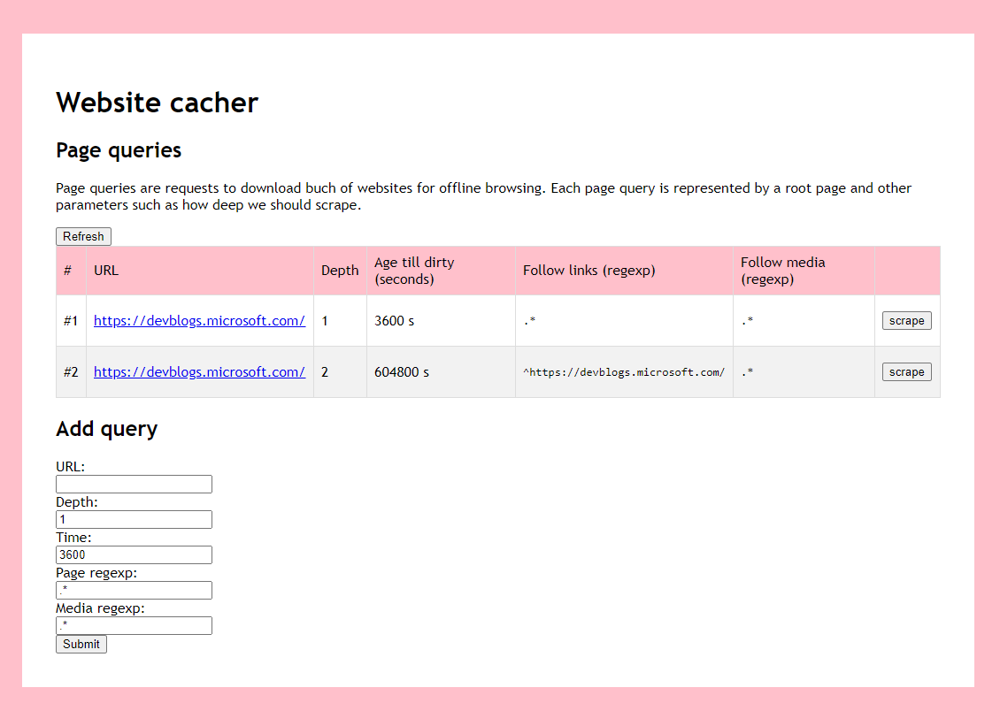

# website-cacher - An amazing project 
Simple utility for downloading web pages for offline browsing.

Application has two parts. Server written in C# .NET Core 3.1 and a web client in Typescript and Node.js. The purpose of the server is to download, scrape and cache webpages which are then server over http client. The server has no user interface. The purpose of the Webclient is to controll the behaviour of the server and give a youser some information when he/she browses the webpages.

## Web client
Web client is located in `WebClient` directory. For now, Web client is very simple just to demonstrate the functionality of the server. Build instructions are:
```PowerShell
cd WebClient
npm install
npm run build
```

Then you have to copy all the files from `WebClient/dist` and `WebClient/static` directories into `static/` directory where the server is located. These files will be hosted by a WebsiteCacher to a client with offline webpages.
```PowerShell
cp WebClient/dist/*
```

## Server
As mentioned above, the server is written in C# .NET Core 3.1 and uses Entity Framework Core. There are following entities:

#### Resource

`Resource` represents a single file which was downloaded from the internet and can be accessed by a web browser.

Resources are identified by their URLs and are stored in local file system under their hash. Therefore multiple URLs with the same content are stored only once. Hash is computed in `HashSolver` class and for now it computes MD5. It may be extended for example to ignore "this page was generated in XX:ZZ" during hash computation.

`Storage` class deals with saving files to local file system. Resources are stored as `downloads/<first 2 letters of hash>/hash`.

#### PageQuery

`PageQuery` represents a request for downloading bunch of websites from the internet. Each query has a starting url address, required depth and regular expressions describing which links to follow. The app is designed to possibly extend PageQuery or create new types.

Scraping is the operation when the internet is scraped starting in url address in PageQuery.

#### Page

`Page` represents a webpage under the specific `PageQuery`. Pages creates a tree with PageQuery as a root. Each page has link to its `Resource`, list of `Page`s which are linked from the page and list of `Resource`s representing media which belong to the page.

There can be multiple `Page` entities with same url because they can belong to different `PageQuery`. The purpose of this is that different `PageQuery`ies may have different requirements to which links to follow or which media (such as .css files) should be downloaded.

---

Each of these three entities is a wrapper for `ResourceData`, `PageQueryData` and `PageData` respectively, which holds data stored in the database.

When you remove `PageQuery` or its content is changed, it may happen that some pages will no longer be linked to the original tree. To remove them, you need to run cleanup method which first removes all `Page`s which are not linked and then all `Resource` which are also not linked.

### Webserver
Content for both resources and webclient is served through `Server` class using `HttpListener`. There is simple MVC architecture in `ServerControllers` directory.

To access downloaded resource, request
```
<server-address>/<absolute-address>
```
for example `http://localhost:8080/http://google.com/`.

#### API
Server uses REST API and .json to comunicate with web client. Webclient is found on the index page (for example `http://localhost:8080/`). Current API calls are:

- `<server-address>/website-cacher://static-content/<file>` - Serves files from `static/` directory. For example `webInjector.js` is injected to every resource when served to user to report information about the links in the webpage.
- `<server-address>/website-cacher://page-queries/add` - Adds new `PageQuery` entry.
- `<server-address>/website-cacher://page-queries/list` - Lists all the `PageQuery`ies.
- `<server-address>/website-cacher://page-queries/scrape/<id>` - Scrapes specified `PageQuery`.
- `<server-address>/website-cacher://resource/status/<resourceURL>` - Gives info about resource.
- `<server-address>/website-cacher://resource/garbage-collect` - Removes resources without page.


### Database
To initialize database please run the following commands in Package Manager Console (PMC)

```PowerShell
Add-Migration WebsiteCacherDatabase
Update-Database
```

# Instructions
1) Open the app and make sure everything is running. Especially, there should be `site_database.db` file and `static/` directory.
2) Open web browser and go to `http://localhost:8080/`.



3) As you can see from the picture, there is a table with current page queries. Currently, there are two page queries to the same page, but the first one forces the page to update every hour. The second query tolerates one week and it follows links up to two clicks but only those which stays on devblogs.microsoft.com.

- You can click on *scrape* to start scraping the website.
- You can add new Page query in the form below the table.
- By clicking on the link in the table, you can browse offline webpages.

When you hover over a link, one of the following three boxes appear and informs you about the state of the link.

**For URLs that was not meant to be cached:**


**For URLs that are not cached yet:**


**For chached URLs:**


